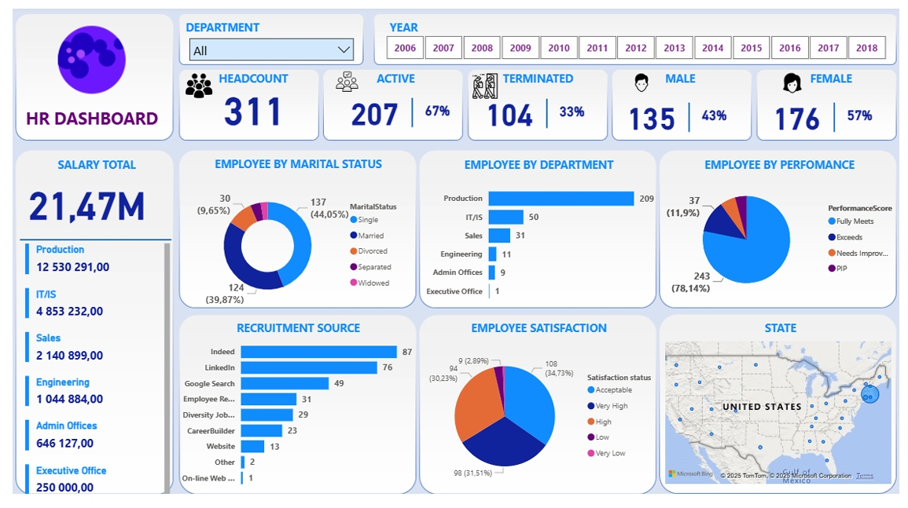

# 📊 Power BI: HR Workforce Dashboard

## Project Overview

This project delivers a comprehensive workforce analysis using a Power BI dashboard built on HR data. The dashboard was designed to give HR teams and management a clear view of **workforce composition, employee performance, satisfaction levels, and recruitment effectiveness** — the metrics that matter most for strategic people decisions.

---

## Dashboard Preview

---

## Methodology

Before building the dashboard, the data required preparation in Power Query:

- Created an **Employment Status** column categorising employees as *Active* or *Terminated*
- Added a **Satisfaction Status** column based on satisfaction score bands
- Built DAX measures for: Active %, Terminated %, Gender breakdown, Headcount, and Total Salary

---

## Key Metrics at a Glance

| Metric | Value |
|--------|-------|
| Total Headcount | 311 |
| Active Employees | 207 (67%) |
| Terminated Employees | 104 (33%) |
| Female Employees | 176 (57%) |
| Male Employees | 135 (43%) |
| Total Salary Spend | $21.47M |

---

## Key Findings

### 1. Termination Rate is a Red Flag
A **33% termination rate** is significantly above healthy benchmarks. The Production department — the largest at 209 employees — is the biggest contributor, meaning satisfaction issues there have an outsized impact on company-wide numbers.

### 2. Performance vs. Satisfaction Gap
**78% of employees are high performers**, yet satisfaction data tells a different story — a large portion report *Low* or *Very Low* satisfaction. This disconnect suggests the issue isn't performance capability, it's employee experience: likely compensation, career growth, or work-life balance.

### 3. Recruitment Channels
The top three sources driving hires are **Indeed (87), LinkedIn (76), and Google Search (49)**. This confirms that digital platforms should remain the primary focus for future hiring investment.

---

## Insights & Implications

The high termination rate paired with strong performance scores points to a retention problem, not a talent problem. Employees are capable but not staying. The data suggests the company needs to investigate whether slow promotion cycles, compensation gaps, or limited development opportunities are driving departures — particularly in Production, where the volume makes any dissatisfaction highly impactful.

---

## Tools Used

- **Power BI Desktop** — dashboard, DAX measures, and data modelling
- **Power Query** — data preparation and column transformations
